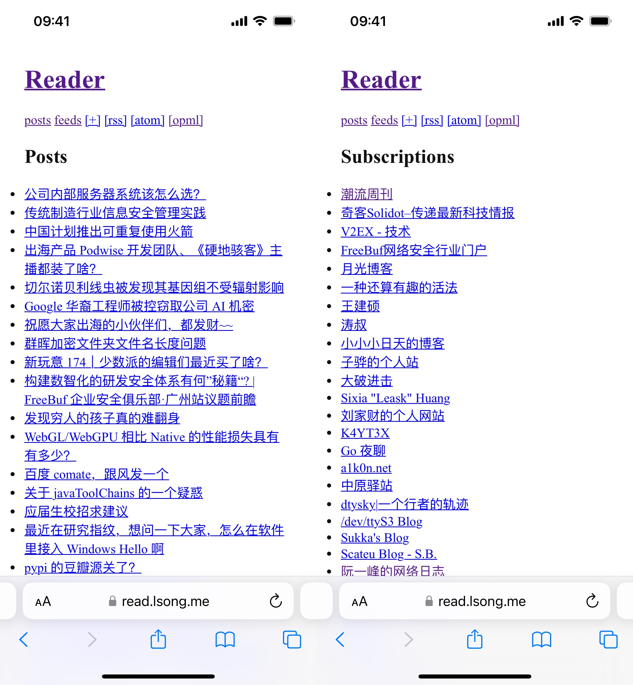
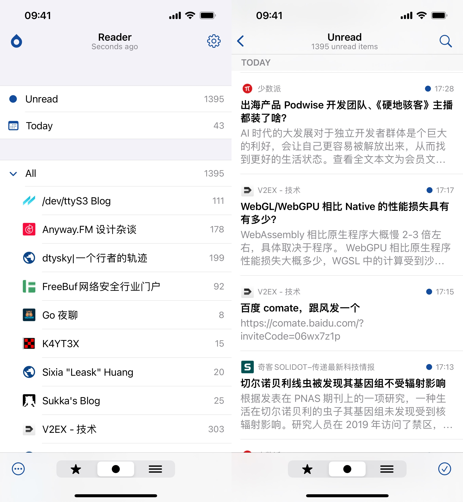

# FeedReader

> **FeedReader**: A Self-hosted RSS Feed Aggregator Service

FeedReader offers a sleek solution for aggregating RSS and ATOM feeds. Designed for those who prefer self-hosted services, it features a minimalistic web UI and supports the Fever API, making it compatible with mainstream RSS clients.

## Screenshots

### Web UI

The server comes with a built-in, minimal web UI for easy feed management.



### Fever API Support

FeedReader supports the [Fever API](https://github.com/song940/fever-go), enabling integration with various RSS client apps.



## Features

- **Minimalist Implementation**: Supports both RSS and ATOM feeds, with OPML import/export functionality.
- **Fever API Integration**: Compatible with popular RSS client apps through built-in Fever API support.

## Installation

To install FeedReader, run the following commands in your terminal:

```shell
curl -L https://github.com/song940/feedreader/releases/download/<tag>/reader-linux-$(uname -m) -o /usr/local/bin/feedreader
chmod +x /usr/local/bin/feedreader
```

Then, create a systemd service file for FeedReader:

```ini
[Unit]
Description=FeedReader - A Self-hosted RSS Feed Aggregator Service
Documentation=https://github.com/song940/feedreader
After=network-online.target
Wants=network-online.target systemd-networkd-wait-online.service

[Service]
ExecStart=/usr/local/bin/feedreader

[Install]
WantedBy=multi-user.target
```

## License

FeedReader is released under the MIT License. For more details, see the [LICENSE](LICENSE) file in the repository.
